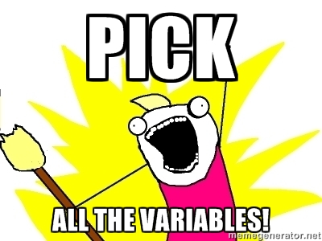

##Getting SEER data

SEER provides their data in a couple of different ways. We'll focus on downloading and assembling binary data. 

###Requesting/Downloading the data
To begin doing anything, you'll have to obtain data. Go to [this page](http://seer.cancer.gov/data/access.html) to request the data and sign their agreement form. 

After returning the agreement form, you'll be linked to [this site](http://seer.cancer.gov/data/options.html). Pick ZIP or exe, whatever you prefer, as long as you download the **ASCII text version of the data**. You'll have to give them your username/pw to download the data, of course.

Unpack the files, they should be something like 3GB total. You'll probably notice that there are dozens of files, spread across several folders. This...is inconvenient. Fortunately, there's an R package for that! 

###Putting all the files together

Thanks to the hard work of researchers at the Cleveland Clinic Foundation, there's an R package that will put those SEER files together. Moreover, you'll have the data in native R format and as a database!

If you're interested in learning more about it, check out the [SEERaBomb page](https://cran.r-project.org/web/packages/SEERaBomb/index.html) at your favorite CRAN mirror. For now, it'll have to suffice to simply *use* the package. 

All the R code on this page will be shown in the HTML version, so don't worry about looking at the source for secrets and tricks. 

Here, we'll load the SEERaBomb package and run the first command for assembling SEER files. **Note**, you'll want to put the SEER data in the same folder as your active R directory. For the purposes of this document, we'll be working on that assumption. 

```{r SEERaBombStart, message = FALSE, warning = FALSE}
#if you haven't installed it yet, uncomment this line
#install.packages("SEERaBomb")

#library(SEERaBomb)

#df <- getFields(seerHome = "SEER_1973_2012_TEXTDATA/")

```

The folder, `SEER_1973_2012_TEXTDATA/`, should have a structure along the lines of the following: (bash ls -rf (some tree structure command run from the folder)


The command `getFields` parses out the SAS files to generate a dataframe (without data yet) that contains all of the SEER fields. The variables

This next command will create a dataframe that only extracts those variables that we want. It was intended to allow the user to select variables of interest, allowing for faster and more streamlined work. I used this package with the intention of exploring the data, so I want all the variables! 

```{r SEERaBombPick, message = FALSE, warning = FALSE}

#df <- pickFields(sas = df, picks = df$names)

```



Finally, we'll go ahead and construct the data. 

```{r SEERaBombDoIt, message = FALSE, warning = FALSE}

#mkSEER(df, seerHome = "SEER_1973_2012_TEXTDATA/")

```


